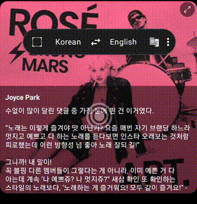
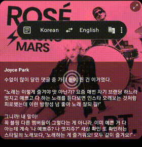
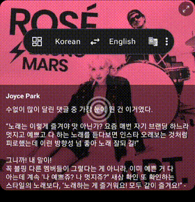
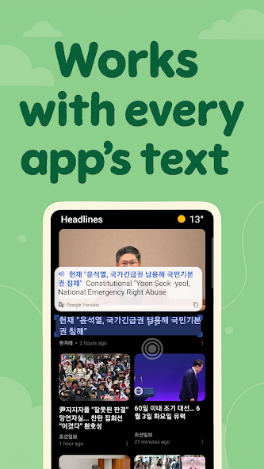
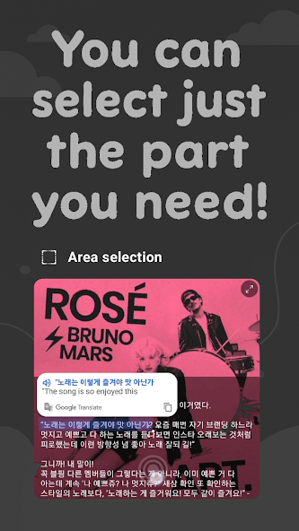
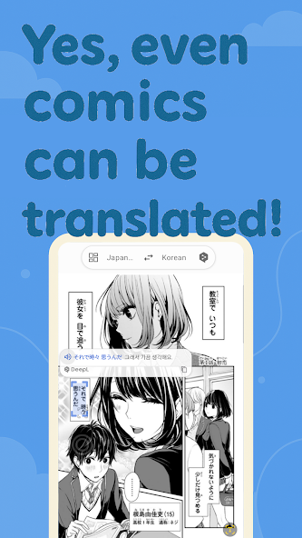
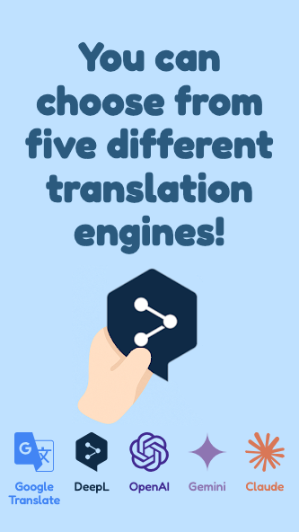
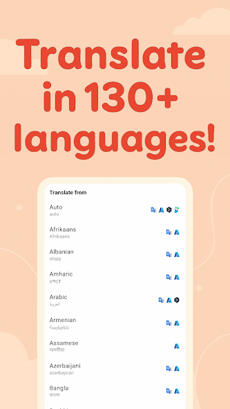

<p align="center">
  
</p>

<h1 align="center">Screen Translate</h1>

<p align="center">
  <strong>Point. Tap. Understand.</strong><br>
  <em>Instantly translate any text on your Android screen — right where it appears.</em>
</p>

<p align="center">
  <a href="https://play.google.com/store/apps/details?id=com.galaxy.airviewdictionary">
    
  </a>&nbsp;
  &nbsp;
  
</p>

<p align="center">
  <a href="https://play.google.com/store/apps/details?id=com.galaxy.airviewdictionary">
    
  </a>
</p>

---

## The Problem

You're reading a webpage in Japanese. Or watching a Korean drama without subtitles. Or trying to use a Chinese app. Every time, you have to:

1. Long-press the text (if you even can)
2. Copy it
3. Switch to a translator app
4. Paste it
5. Read the translation
6. Switch back

**What if you could just... point at it?**

---

## How It Works

Screen Translate floats on top of whatever you're doing. Just drag the pointer to any text, and the translation appears instantly — like magic.

<table>
  <tr>
    <td align="center" width="50%">
      <strong>Word Mode</strong><br>
      <em>Tap any word for instant translation</em><br><br>
      
    </td>
    <td align="center" width="50%">
      <strong>Sentence Mode</strong><br>
      <em>Auto-detects and translates full sentences</em><br><br>
      
    </td>
  </tr>
  <tr>
    <td align="center">
      <strong>Paragraph Mode</strong><br>
      <em>Translates entire blocks of text at once</em><br><br>
      
    </td>
    <td align="center">
      <strong>Selection Mode</strong><br>
      <em>Draw a box around exactly what you need</em><br><br>
      
    </td>
  </tr>
</table>

Plus **Fixed Area** mode: pin a region of the screen and it re-translates automatically whenever the text changes — made for game dialogue and video subtitles.

---

## Works Everywhere

<p align="center">
  
  &nbsp;&nbsp;
  
  &nbsp;&nbsp;
  
</p>

<p align="center">
  News apps, social media, games, manga, webtoons — if there's text on screen, it can be translated.
</p>

---

## Pick Your Translation Engine

<p align="center">
  
</p>

Not all translation engines are created equal. Screen Translate lets you switch between **five engines** to find the best one for your language pair:

<table>
  <tr>
    <td align="center" valign="top" width="20%">
      <br><br>
      <strong>Google Translate</strong><br>
      <sub>The all-rounder. Fast, free,<br>and built in — no key needed.</sub>
    </td>
    <td align="center" valign="top" width="20%">
      <br><br>
      <strong>DeepL</strong><br>
      <sub>Natural, human-sounding<br>translations. Best for European languages.</sub>
    </td>
    <td align="center" valign="top" width="20%">
      <br><br>
      <strong>OpenAI</strong><br>
      <sub>LLM translation that keeps<br>context, tone, and idiom.</sub>
    </td>
    <td align="center" valign="top" width="20%">
      <br><br>
      <strong>Gemini</strong><br>
      <sub>Google's LLM. Fast, with a<br>generous free tier.</sub>
    </td>
    <td align="center" valign="top" width="20%">
      <br><br>
      <strong>Claude</strong><br>
      <sub>Anthropic's LLM. Strong at<br>nuance and longer passages.</sub>
    </td>
  </tr>
</table>

> Google works out of the box. **DeepL, OpenAI, Gemini and Claude run on your own API key** — enter it under *Settings → API Key*. For the three LLM engines you can also choose the model, send the surrounding on-screen text as context (so pronouns and ambiguous words come out right), and set the translation style (literal, natural, liberal) and subject (game, comic, technical, business).

> **A note on the screenshots:** some still show the older engine line-up, which included **Azure Translator** and **Papago**. Those two ran on API keys the app handed out to paid installs — when the paid features were removed, the keys went away and those engines went with them. DeepL and OpenAI stayed on by switching to keys you supply yourself.

---

## 130+ Languages

<p align="center">
  
</p>

From Arabic to Zulu, from English to Japanese — translate between **130+ languages** with automatic source language detection. No need to manually set what language you're reading.

Screen text is read on-device for Latin, Chinese, Japanese, Korean and Devanagari scripts and — **new in 2.8** — Arabic script (Arabic, Persian, Urdu…), Cyrillic (Russian, Ukrainian, Belarusian, Bulgarian) and Thai. *Auto* picks the right recognizer for each screen. Languages in scripts the app can't read yet, such as Greek or Hebrew, stay available as translation targets.

---

## Why I Built This

I live between languages every day, and existing solutions all required too many steps. I wanted something that just **works** — point at text, get the meaning. No context switching, no clipboard juggling.

Over time, it grew into a full-featured translation tool with multiple engines and smart text recognition. And now **over 1 million people** use it.

---

## Under the Hood

> *For the curious developers who want to peek inside.*

### How the magic happens

1. **Screen Capture** — Android's `MediaProjection` API continuously captures what's on your screen
2. **Text Recognition** — **On-device OCR** finds the text in the captured frame: Google ML Kit for Latin, Chinese, Japanese, Korean and Devanagari, and PaddleOCR's **PP-OCRv5** on ONNX Runtime for Arabic-script, Cyrillic and Thai. On *Auto*, a quick sample decides which recognizer fits the screen, and PP-OCRv5 reads only the paragraph you point at
3. **Smart Grouping** — A custom algorithm clusters detected text into words, lines, sentences, or paragraphs based on position, spacing, and font size, keeping right-to-left lines in reading order
4. **Translation** — The recognized text is sent to your chosen translation engine via REST APIs
5. **Overlay Rendering** — Results are displayed in a floating Compose UI overlay on top of your current app

With a fixed source language, all of this usually takes **about a second**.

### Tech highlights

| | |
|---|---|
| **Kotlin + Jetpack Compose** | Modern Android UI with reactive state management |
| **Adaptive, edge-to-edge UI** | Scales cleanly from phones to tablets and foldables |
| **Clean Architecture + MVVM** | Separation of concerns with ViewModels and Repositories |
| **Hilt** | Dependency injection for clean, testable code |
| **Pluggable OCR engines** | ML Kit and PP-OCRv5 behind one engine-neutral text model; *Auto* picks the recognizer per screen |
| **ML Kit** | On-device OCR for Latin, Chinese, Japanese, Korean, and Devanagari scripts, plus language identification |
| **PP-OCRv5 + ONNX Runtime** | On-device OCR for Arabic-script, Cyrillic, and Thai; only the paragraph you point at is read |
| **Play Asset Delivery** | The PP-OCRv5 models ship as a fast-follow pack, so the base APK stays small |
| **Right-to-left aware** | Unicode bidi runs keep Arabic, Persian, and Urdu lines in reading order |
| **Multi-engine translation** | Google, DeepL, OpenAI, Gemini, and Claude behind one interface |
| **Coroutines + StateFlow** | Stale OCR and translation work is cancelled the moment the pointer moves |
| **Firebase** | Analytics, Crashlytics, and Remote Config — AI model lists and kill switches change without an app update |
| **Firebase App Check** | Play Integrity attestation for backend requests |
| **AdMob + UMP** | A rewarded-ad gate — how the app stays free — with a consent prompt where the law requires one |
| **Play In-App Review** | Asks for a rating inside the app, without sending you to the store |
| **Encrypted key storage** | AES-GCM + Android Keystore for user-supplied API keys |
| **MediaProjection** | Real-time screen capture with optimized frame streaming |

### Project structure

```
app/src/main/java/com/galaxy/airviewdictionary/
├── core/                  # OverlayService — the heart of the app
├── data/
│   ├── local/
│   │   ├── vision/        # Recognition, text grouping, lazy paragraph reading
│   │   │   ├── kit/       # OCR engines: ML Kit, PP-OCRv5 (paddle/), Auto selection
│   │   │   ├── ocr/       # Engine-neutral OCR text and reading order
│   │   │   └── model/     # Words, lines, sentences, paragraphs
│   │   ├── capture/       # Screen capture via MediaProjection
│   │   ├── screen/        # Screen size and orientation
│   │   ├── tts/           # Text-to-Speech
│   │   ├── secure/        # Encrypted storage for user API keys
│   │   ├── ads/           # Rewarded-ad gate policy and state
│   │   └── preference/    # User settings
│   └── remote/
│       ├── translation/   # Google, DeepL, OpenAI, Gemini, Claude
│       ├── firebase/      # Analytics & Remote Config
│       └── geolocale/     # Region lookup
├── ui/
│   ├── screen/
│   │   ├── overlay/       # Floating UI: handle, menu bar, translation window,
│   │   │                  #   area selection, fixed area, text highlight
│   │   ├── main/          # Settings screens
│   │   ├── ads/           # Rewarded-ad gate and in-app review
│   │   ├── reply/         # Reply translation window
│   │   ├── permissions/   # Screen-capture and notification permission flows
│   │   ├── onboarding/    # First-time setup
│   │   └── intro/         # Splash screen
│   ├── common/            # Shared components
│   └── theme/             # Compose theme
├── di/                    # Hilt dependency injection
└── extensions/            # Kotlin extension functions
```

`paddle_models/` at the repository root is the Play Asset Delivery module that carries the PP-OCRv5 models (see *Building from Source*).

---

## Building from Source

### What you need

- **Android Studio** (2025.3 or later — the project builds with AGP 9)
- **JDK 17**
- **Android SDK 36**

### Steps

1. **Clone the repo**
   ```bash
   git clone https://github.com/AidanPark/screen-translator.git
   cd screen-translator
   ```

2. **Set up signing** — Edit `gradle.properties`:
   ```properties
   KEYSTORE_FILE=your-keystore.jks
   KEY_ALIAS=your-key-alias
   KEY_PASSWORD=your-key-password
   ```

3. **Add Firebase config** — Place your own `google-services.json` in the `app/` directory

4. **Build & Run**
   ```bash
   ./gradlew assembleDebug
   ```

> **Note:** You'll need your own Firebase project to run the full app. Google translation and the on-device OCR need no API key at all. DeepL, OpenAI, Gemini and Claude are optional — they use keys you enter inside the app at runtime (*Settings → API Key*), not build-time config.

> **PP-OCRv5 models are not included.** Without them the app falls back to ML Kit, so Arabic-script, Cyrillic and Thai screen text isn't recognized. To enable it, export PaddleOCR's PP-OCRv5 text detection model and its Arabic, East Slavic and Thai recognition models to ONNX, and put them with their dictionaries in `paddle_models/src/main/assets/paddle/` as `det.onnx`, `arabic_rec.onnx` + `arabic_dict.txt`, `eslav_rec.onnx` + `eslav_dict.txt`, and `th_rec.onnx` + `th_dict.txt`. The models are Apache-2.0 licensed by PaddlePaddle.

---

## Permissions Explained

| Permission | What it does |
|-----------|-------------|
| **Display over other apps** | Shows the floating translation overlay |
| **Screen capture** | Reads text from your screen using OCR |
| **Internet** | Connects to translation APIs |
| **Vibration** | Gives haptic feedback when text is detected |
| **Notifications** | Required for the foreground service indicator |

---

## License

Source-available under the [PolyForm Noncommercial License 1.0.0](LICENSE):

- **Free for any noncommercial use.** Personal use, study, research, hobby projects, and noncommercial organizations may use, modify, and share it, keeping the license and the [NOTICE](NOTICE).
- **No commercial use without permission.** Selling it, shipping it (or a modified version) in an app with ads or in-app purchases, or using it in a business requires a separate license. To ask, open an [issue](https://github.com/AidanPark/screen-translator/issues).

Versions up to commit `8717cf0` (2026-09-23) were released under the Apache License 2.0 and stay under it. Third-party parts keep their own licenses; see [NOTICE](NOTICE).

---

<p align="center">
  <a href="https://play.google.com/store/apps/details?id=com.galaxy.airviewdictionary">
    
  </a>
  <br><br>
  <sub>Made with caffeine and curiosity.</sub>
</p>
